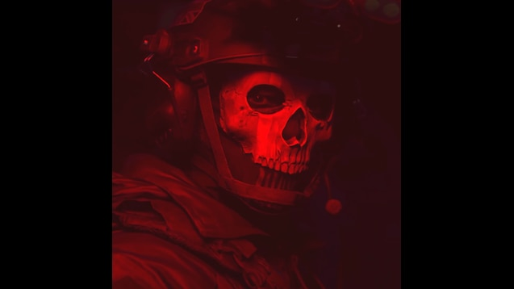

<div align="center">
  
</div>

# Pars

Developer // Linux Enthusiast // Systems Builder

I build, break, and rebuild systems. Focused on low-level configuration, performance optimization, and bridging hardware with software.

---

## [ ABOUT ]

My interests lie in the intersection of software and hardware.

- Linux & custom distributions
- System administration and low-level configuration
- Security & DevSecOps
- Web development
- Embedded systems
- Networking & mesh communication
- Local / lightweight AI tools
- Performance optimization
- Breathing life into old hardware

---

## [ PROJECTS ]

### Ankora Linux
A Debian-based Linux distribution focused on lightweight desktop experiences, old hardware compatibility, and security-oriented configuration. Built with Refract for custom ISO creation.  
*Status: Active Development*

### Ankora Linux Website
The web presence for the project. Modern, responsive, multi-language architecture with clean documentation and a lightweight frontend.  
*Stack: HTML / CSS / JavaScript*

### Embedded Experiments
Hardware-focused experiments involving ESP32, custom PCB ideas, nRF/RF projects, antenna experiments, and mesh networking concepts.

### Old Hardware Projects
Giving old machines a second life. Linux optimization, lightweight desktop environments, low-resource systems, and home file-server concepts.

---

## [ TECH STACK ]

### Languages & Dev
<p>

</p>

### Systems & Tools
<p>

</p>

### Hardware
<p>

</p>

---

## [ SECURITY FOCUS ]

Security is part of the development process, not an afterthought.

- **Privilege Escalation:** sudo / root permissions, service privileges, executable permissions.
- **System Security:** systemd services, startup scripts, file permissions, authentication configuration.
- **Supply Chain:** package verification, GPG signatures, external downloads, build-time dependencies.
- **Application Security:** command injection, unsafe input handling, exposed secrets, unnecessary network access.


## [ WHAT I BUILD ]


Linux distributions       ████████████████████
System optimization       ██████████████████░░
Embedded systems          ████████████████░░░░
Web projects              ███████████████░░░░░


[ GITHUB STATS ]
<div align="center">   </div>
<div align="center">  </div>


[ PHILOSOPHY ]
Build it. Test it. Break it. Understand it. Improve it.

I prefer learning by actually building things—especially projects that force me to understand what is happening underneath the interface.


[ TOOLS ]
Area	Tools
OS	Linux / Debian / Pardus
Version	Git / GitHub
Editors	VS Code & terminal-based tools
System	Bash / systemd / Refract
Web	HTML / CSS / JavaScript
Embedded	ESP32 / Arduino / nRF
Security	Linux hardening / DevSecOps

<div align="center">
Thanks for visiting.
Keep building. Keep learning. Keep breaking things.

</div> ```
Security                  ██████████████░░░░░░
Networking / Mesh         █████████████░░░░░░░
AI experiments            ████████████░░░░░░░░
